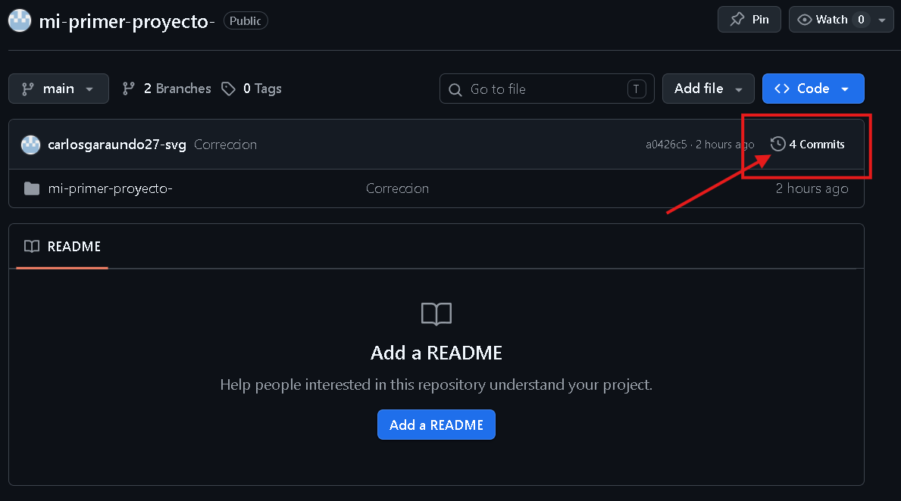

#   Laboratorio 01: Configuración del Entorno y Repositorio

## Descripción del Estudiante
*   **Nombre:** Carlos Leonardo
*   **Carrera:** Ingeniería de Sistemas
*   **Universidad:** Universidad Nacional de San Cristóbal de Huamanga (UNSCH)
*   **Serie:** 400 - I

---

## Descripción del Proyecto
### Objetivo del Laboratorio
Preparar el entorno base del curso, definir convenciones de trabajo y dominar herramientas de versionamiento para asegurar la calidad desde el inicio del desarrollo.

---

### Herramientas y Comandos 
Aqui pondre los comandos que suelo usar en mi flujo de trajo actual:

### Herramientas Utilizadas
*   **Node.js:** Entorno de ejecución para JavaScript (v22 recomendada).
*   **Git:** Sistema de control de versiones.
*   **GitHub:** Plataforma de alojamiento de repositorios.
*   **VS Code:** Editor de código con extensiones técnicas (GitLens, ESLint).

## Pasos Realizados
1.  **Instalación del Stack:** Se instaló Node.js y se verificó mediante la terminal.
2.  **Configuración de Identidad:** Configuración global de usuario y correo institucional en Git.
3.  **Inicialización:** Creación del repositorio local y estructuración inicial del proyecto.
4.  **Vinculación Remota:** Creación del repositorio en GitHub y conexión mediante el protocolo HTTPS.
5.  **Ciclo de Commits:** Ejecución de commits siguiendo buenas prácticas para mantener un historial legible.

### Comandos de Git Utilizados
| Comando | Descripción |
|---------|-------------|
| `git clone url` | Clona un repositorio remoto. |
| `git init` | Inicia un nuevo repositorio local. |
| `git add .` | Prepara todos los archivos para el commit. |
| `git commit -m "mensaje"` | Guarda los cambios con un mensaje descriptivo. |
| `git status` | Muestra el estado actual del área de trabajo. |
| `git push origin main` | Sube los cambios al servidor remoto. |
| `git pull origin main` | Descarga los cambios del servidor remoto. |

### Terminal y Sistemas
*   `ls` / `dir` - Listar archivos.
*   `cd` - Navegar entre directorios.
*   `mkdir` - Crear nuevas carpetas.
*   `cat` - Ver contenido de archivos rápidamente.

---

## Evidencias del Laboratorio
### Capturas de Pantalla
*   **Verificación de versiones:** 
*   **Historial de Commits:** 

---

Nota de Revisión
> [!IMPORTANT]
> Para fines de didacticos, este repositorio ha sido estructurado para ser revisado a través de los **Commits** que muestran el progreso y la lógica aplicada en este proyecto.

---

## Contacto
*   **Ubicación:** Ayacucho, Perú
*   **Intereses:** DevSecOps, Optimización de PC y Edición de Video.